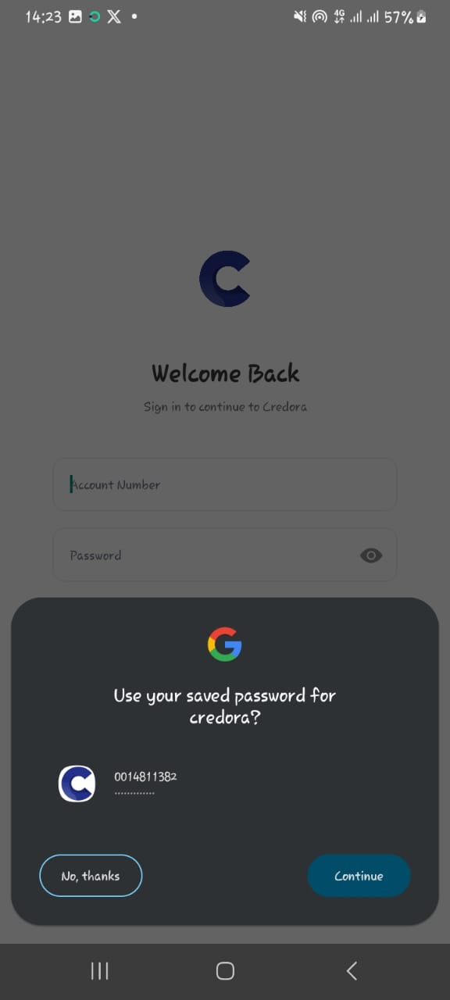
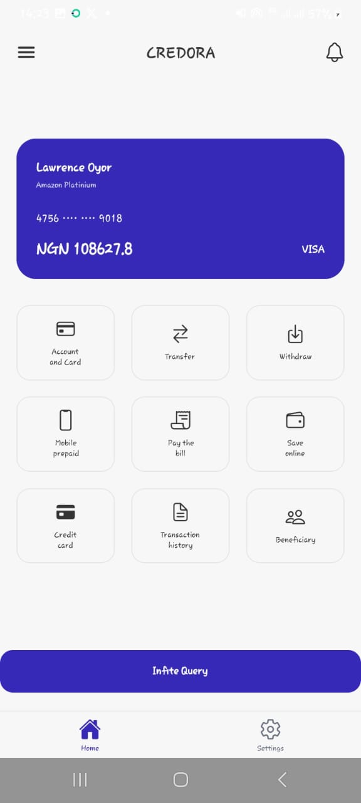
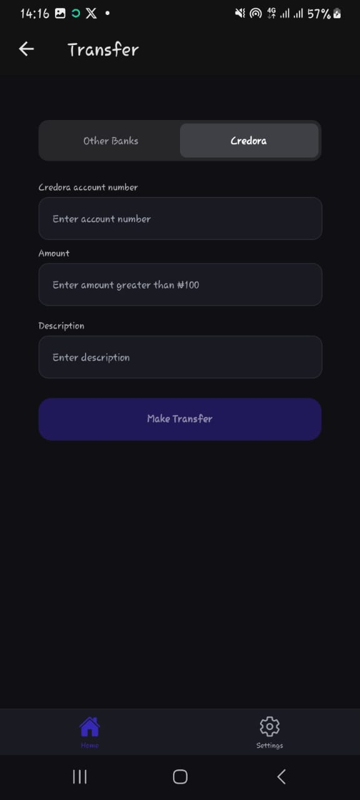
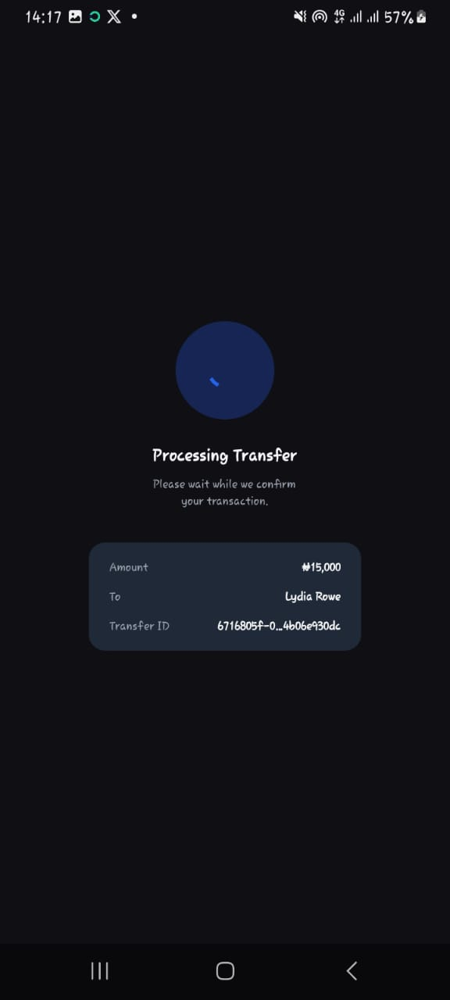
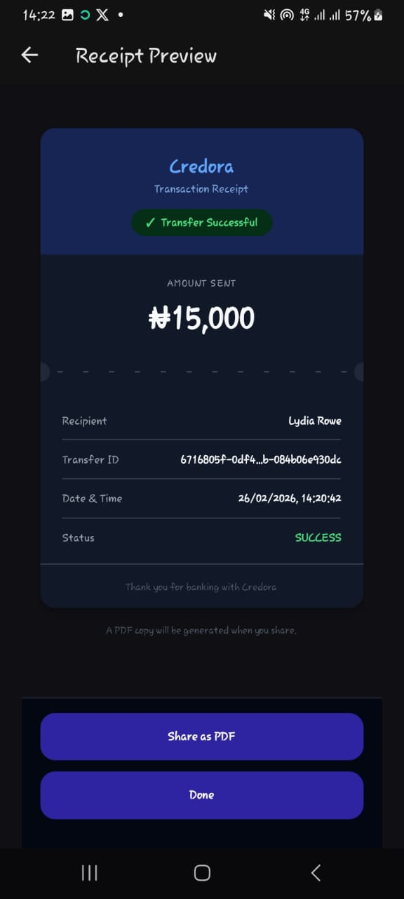
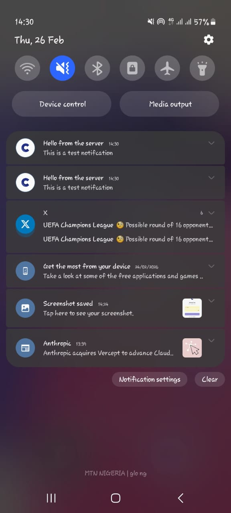

# Credora Mobile App

Credora is a mobile banking simulator that allows users to send and receive money in a controlled environment. The app simulates core digital banking flows including authentication, internal transfers, transaction history, and push notifications.

It is powered by a [Go backend](https://github.com/EfosaE/credora-backend) and integrates with Monnify for external transfer simulation.

---

## Overview

Credora replicates the experience of a modern banking application. Users can create and manage accounts, authenticate securely, transfer funds internally, view transaction history, and receive real-time push notifications.

The application is built using Expo (React Native) and communicates with a backend API.

---

## Features

**Authentication**

- Email or account number login
- Password authentication
- OTP verification flow
- Secure session handling

**Transfers**

- Internal transfers between Credora accounts
- Real-time balance updates
- Transaction status feedback

**Transaction History**

- Detailed transaction list
- Status indicators
- Timestamped records

**Notifications**

- Push notifications using Firebase Cloud Messaging (FCM)
- Transfer confirmations
- Account activity alerts

---

## Tech Stack

- Expo
- React Native
- TypeScript
- Expo Router (file-based routing)
- Firebase Cloud Messaging (FCM)

---

## Project Structure

```
app/
├── (auth)/
├── (tabs)/
components/
hooks/
services/
constants/
```

- `app/` – Route-based screens
- `components/` – Reusable UI components
- `services/` – API communication layer
- `hooks/` – Custom React hooks

---

## Getting Started

### 1. Install Dependencies

```bash
npm install
```

### 2. Start the Development Server

```bash
npx expo start
```

You can run the app on an Android emulator, iOS simulator, or a physical device using Expo Go.

---

## Environment Configuration

Create a `.env` file in the root directory:

```env
EXPO_PUBLIC_API_BASE_URL=http://localhost:8080
EXPO_PUBLIC_FCM_PROJECT_ID=your_project_id
```

> Restart the dev server after modifying environment variables.

---

## Screenshots

## Application Flow

### Authentication

| Login Step 1                         | Login Step 2                          |
| ------------------------------------ | ------------------------------------- |
|  |  |

---

### Dashboard

| Light Mode                            | Dark Mode                            |
| ------------------------------------- | ------------------------------------ |
|  |  |

---

### Internal Transfer Flow

| Transfer Details                      | Confirm Transfer                      |
| ------------------------------------- | ------------------------------------- |
|  |  |

| Processing                       | Result                              |
| -------------------------------- | ----------------------------------- |
|  |  |

---

### Receipt & Notifications

| Receipt Preview                      | Notifications                           |
| ------------------------------------ | --------------------------------------- |
|  |  |

---

## Security Notes

OTP verification is required for all sensitive operations.

---

## Future Improvements

- Notifications wired to actual app events
- Biometric authentication
- External transfer UI enhancements
- Improved analytics dashboard
