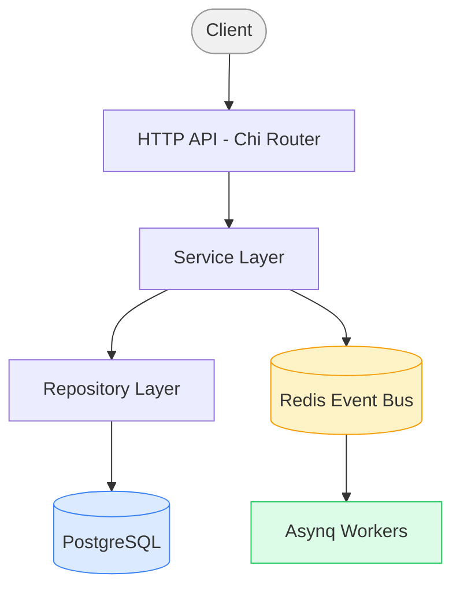
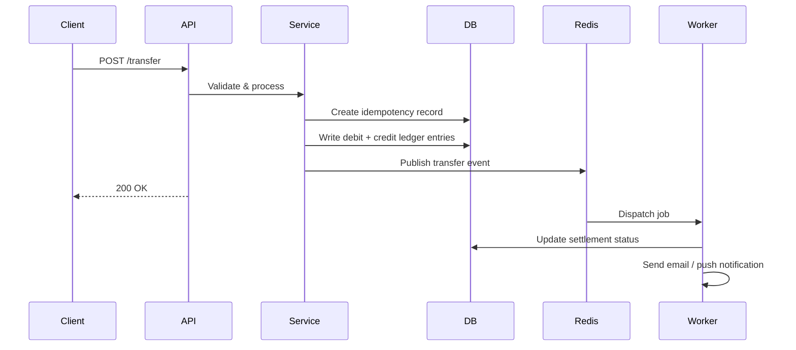
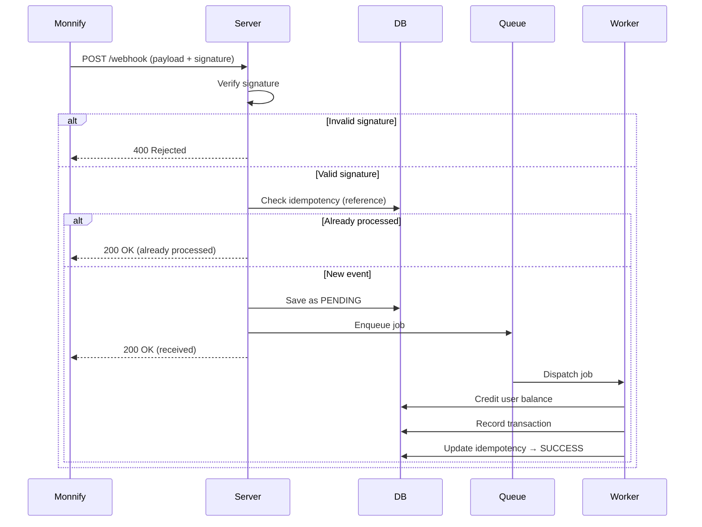

# Credora Backend

## Overview

Credora is the backend engine of a modern digital banking platform. Think of it as the invisible infrastructure that makes financial products work — processing payments securely, keeping account balances accurate to the cent, and reacting to real-world banking events in real time.

It is built in **Go** and designed to reflect how production fintech systems actually operate — not a toy project, but an implementation of the same patterns used by real payment platforms.

> If you're **non-technical**: Credora handles the hard parts of digital banking — making sure money moves correctly, no transaction is counted twice, and the system keeps working even when things go wrong.
>
> If you're **technical**: Credora implements double-entry ledger accounting, idempotent payment processing, event-driven async workers via Redis + Asynq, and virtual account infrastructure through Monnify — all in Go with PostgreSQL.

---

## Live Architecture

This is how a request flows through the system — from a user action all the way to the database and background workers:


```mermaid
graph TD
    A([Client]) --> B[HTTP API - Chi Router]
    B --> C[Service Layer]
    C --> D[Repository Layer]
    D --> E[(PostgreSQL)]
    C --> F[(Redis Event Bus)]
    F --> G[Asynq Workers]

    style A fill:#f0f0f0,stroke:#999
    style E fill:#dbeafe,stroke:#3b82f6
    style F fill:#fef3c7,stroke:#f59e0b
    style G fill:#dcfce7,stroke:#22c55e
```

**How it works in plain terms:**
1. A user makes a request (e.g. send money)
2. The API layer validates it and passes it to the service layer (the business logic brain)
3. The service layer saves data to PostgreSQL and publishes an event to Redis
4. Background workers pick up those events and handle follow-up tasks like sending notifications

---

## Transaction Flow

Here's what happens inside Credora when an internal transfer is initiated:


```mermaid
sequenceDiagram
    participant Client
    participant API
    participant Service
    participant DB
    participant Redis
    participant Worker

    Client->>API: POST /transfer
    API->>Service: Validate & process
    Service->>DB: Create idempotency record
    Service->>DB: Write debit + credit ledger entries
    Service->>Redis: Publish transfer event
    API-->>Client: 200 OK
    Redis->>Worker: Dispatch job
    Worker->>DB: Update settlement status
    Worker->>Worker: Send email / push notification
```

---

## Webhook Flow (Monnify)

When an external payment provider like Monnify sends a payment notification (webhook), Credora handles it safely and exactly once — even if the provider retries:


```mermaid
sequenceDiagram
    participant Monnify
    participant Server
    participant DB
    participant Queue
    participant Worker

    Monnify->>Server: POST /webhook (payload + signature)
    Server->>Server: Verify signature
    alt Invalid signature
        Server-->>Monnify: 400 Rejected
    else Valid signature
        Server->>DB: Check idempotency (reference)
        alt Already processed
            Server-->>Monnify: 200 OK (already processed)
        else New event
            Server->>DB: Save as PENDING
            Server->>Queue: Enqueue job
            Server-->>Monnify: 200 OK (received)
            Queue->>Worker: Dispatch job
            Worker->>DB: Credit user balance
            Worker->>DB: Record transaction
            Worker->>DB: Update idempotency → SUCCESS
        end
    end
```

> **Why does this matter?** Payment providers often retry webhooks if they don't get a fast response. Without careful handling, a user could get credited twice for the same payment. Credora prevents this using idempotency — every incoming event gets a unique reference, and if it's already been processed, we skip it safely.

---

## Key Engineering Concepts

### Double-Entry Ledger System

Every transfer creates two ledger entries — a **debit** and a **credit**. This is the same model used by real banks and accounting systems. It means the books always balance, and every movement of money is traceable.

```
Transfer ₦5,000 from Alice → Bob

Debit:   Alice's account  -₦5,000
Credit:  Bob's account    +₦5,000
```

### Idempotent Payment Processing

If a client sends the same transfer request twice (e.g. due to a network retry), Credora recognises the duplicate and returns the original result — no double charges, no duplicate records.

### Event-Driven Architecture

Rather than doing everything synchronously in the request cycle, Credora publishes events to Redis and lets background workers handle non-critical tasks. This keeps API responses fast and the system resilient.

Background jobs include:
- Email notifications
- Firebase push notifications
- Transfer processing
- Account creation events

---

## Core Features

| Feature | Description |
|---|---|
| **Authentication** | JWT-based login and registration |
| **Virtual Accounts** | Monnify integration for reserved bank accounts |
| **Internal Transfers** | Ledger-accurate transfers between accounts |
| **Webhook Processing** | Idempotent ingestion of external payment events |
| **Transaction History** | Full audit trail of all financial movements |
| **Async Workers** | Background job processing via Redis + Asynq |
| **API Docs** | Swagger/OpenAPI documentation |

---

## Tech Stack

| Layer | Technology |
|---|---|
| Language | Go 1.24+ |
| Database | PostgreSQL (via `pgx` + `sqlc`) |
| Cache / Queue | Redis + Asynq |
| HTTP Router | Chi |
| Notifications | Firebase Cloud Messaging, Mailtrap |
| Auth | JWT |

---

## Project Structure

```
cmd/
  server/          # HTTP server entrypoint
  worker/          # Background worker entrypoint
  cli/             # CLI utilities

internal/
  config/          # App configuration
  router/          # Route definitions
  handlers/        # HTTP request handlers
  queues/          # Job definitions and queue setup

service/           # Business logic layer

infrastructure/    # Repository implementations & 3rd-party adapters
                   # (Firebase, Monnify, etc.)

domain/            # Core models and shared utilities
```

---

## Running Locally

**Requirements:** Go 1.24+, PostgreSQL, Redis

```bash
# Run database migrations
make migrate-up

# Start the API server
make run

# Start the background worker (separate terminal)
make start-worker

# API docs available at:
# http://localhost:8080/api/v1/documentation
```

---

## Testing

```bash
# Unit tests
make test

# Integration tests
make test-integration
```

---

## Technical Writing

Articles by the author on the concepts powering this project:

- [The math behind scaling job processors](https://medium.com/@osamwonyiefosa02/understanding-queue-backlogs-worker-saturation-and-the-math-behind-scaling-job-processors-0136599eb48e)
- [Deploying a Dockerized Golang Server on EC2 and ECR](https://efosae.hashnode.dev/deploying-a-containerized-app-to-aws-ec2)
- [I Built My Own OpenAPI Generator in Go (Without a Single Library)](https://medium.com/@osamwonyiefosa02/i-built-my-own-openapi-generator-in-go-without-a-single-library-dabf21804794)

**Coming soon:**
- Designing a Double-Entry Ledger in Go
- Handling Idempotent Payment Webhooks
- Building Event-Driven Systems with Redis and Go

---

## Author

**Efosa Osamwonyi** — Backend Engineer

Focus areas: backend systems · fintech infrastructure · event-driven architecture